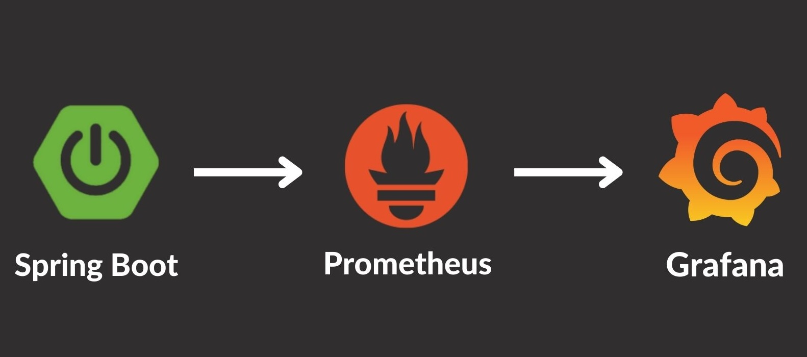

# Spring Actuator

***

### Spring Actuator
Spring Application의 상태를 모니터링하고 관리하는 기능을 제공하는 라이브러리이다. Spring의 Micrometer를 기반으로 동작한다.

- default endpoint: http://localhost:8080/actuator
    - 아래와 같이 링크에 접근했을때, Json 형태로 새로운 링크를 제공하는 것을 Hateoas(헤이티오스)라고 한다.
```json
{
  "_links": {
    "self": {
      "href": "http://localhost:8080/actuator",
      "templated": false
    },
    "health-path": {
      "href": "http://localhost:8080/actuator/health/{*path}",
      "templated": true
    },
    "health": {
      "href": "http://localhost:8080/actuator/health",
      "templated": false
    }
  }
}
```
- default health endpoint: http://localhost:8080/actuator/health
```json
{
  "status": "UP"
}
```

<br>

### Spring Actuator Basic Endpoint Setting
- endpoint enable, exposure 설정을 모두 해줘야 actuator endpoint를 사용할 수 있다.
```properties
# spring actuator setting
#management.endpoint.beans.enabled=true

management.endpoints.web.exposure.include=*
#management.endpoints.web.exposure.exclude=*
```

<br>

### Spring Actuator Custom Endpoint Setting
- @Endpoint, @ReadOperation, @WriteOperation 등 Spring Actuator에서 제공하는 어노테이션을 이용해 Custom endpoint를 구성할 수 있다.
```java
/**
 * Spring actuator custom endpoint example code
 * @implNote @WriteOperation: POST method 처럼 쓰기할때 사용
 * @implNote @ReadOperation: GET method 처럼 읽기할때 사용
 * */
@Component
@Endpoint(id = "custom")
@Slf4j(topic = "ActuatorCustomEndpoint")
public class ActuatorCustomEndpoint {

    @WriteOperation
    public void write(String data) {
        log.info("write operation: {}", data);
    }

    @ReadOperation
    public List<ActuatorCustomData> custom(@Selector String data1, String data2) {
        List<ActuatorCustomData> list = new ArrayList<>();

        for (int i = 1; i <= 3; i++) list.add(new ActuatorCustomData("custom data" + i));

        //utilize path variable
        list.add(new ActuatorCustomData(data1));

        //utilize parameter
        list.add(new ActuatorCustomData(data2));

        return list;
    }

    @Getter
    public static class ActuatorCustomData {
        private final String data;

        public ActuatorCustomData(String data) {
            this.data = data;
        }
    }
}

```
- request url: `http://localhost:8080/actuator/custom/path_data1?data2=parameter_data1`
```json
[
  {
    "data": "custom data1"
  },
  {
    "data": "custom data2"
  },
  {
    "data": "custom data3"
  },
  {
    "data": "path_data1"
  },
  {
    "data": "parameter_data1"
  }
]
```

<br>

### Using Prometheus & Grafana
- Spring Actuator는 기본적으로 Micrometer를 사용하고 있기 때문에, Prometheus와 Grafana를 사용하여 모니터링을 할 수 있다.
- Prometheus가 Spring Actuator의 endpoint를 통해 데이터를 수집하고, Grafana가 Prometheus의 데이터를 시각화한다.




<br><br>
### References
- [Spring actuator docs](https://docs.spring.io/spring-boot/docs/current/reference/html/actuator.html#actuator.endpoints)
- [Inflearn spring actuator](https://www.inflearn.com/course/spring-boot-actuator-%ED%8C%8C%ED%97%A4%EC%B9%98%EA%B8%B0/dashboard)